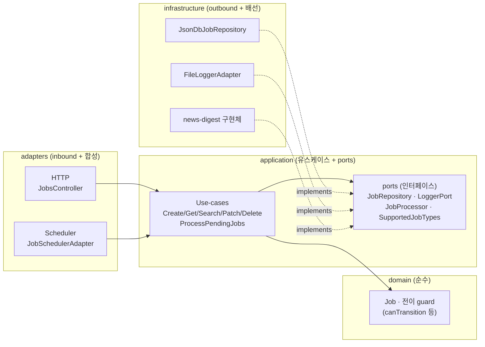
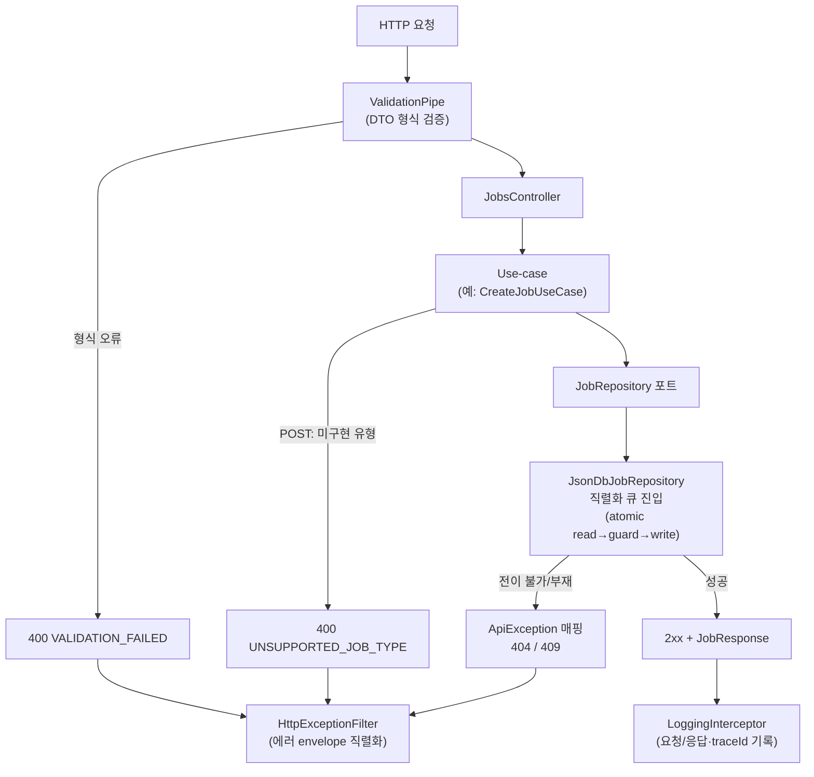
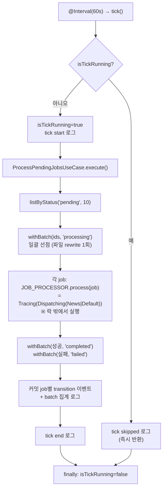
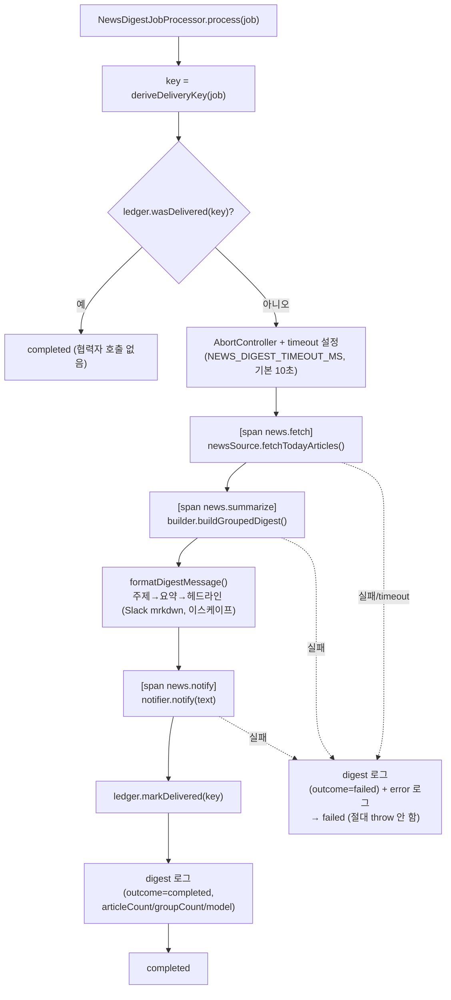

# 아키텍처 안내서 (ARCHITECTURE)

이 문서는 `us-all-job-manager`의 내부 구조와 동작을 상세히 설명합니다. 사용자 관점의 설치·실행·검증은
[README.md](./README.md)를 참고하시고, 이 문서는 **API와 스케줄러가 어떻게 구현되어 있고 어떤 순서로
동작하는지**, 그리고 **뉴스 전달 프로그램이 실제로 어떻게 실행되는지**를 함수 흐름도와 함께 다룹니다.

설계 결정의 정본(正本)은 [`logs/20260717/implementation-design/09-final-design.md`](./logs/20260717/implementation-design/09-final-design.md)이며,
코드와 문서가 어긋나면 정본 로그를 먼저 갱신한 뒤 본 문서를 맞춥니다.

## 목차
0. [개요와 계층 구조](#0-개요와-계층-구조)
1. [API 구현과 동작](#1-api-구현과-동작)
2. [스케줄러 구현과 동작](#2-스케줄러-구현과-동작)
3. [뉴스 전달 프로그램 동작](#3-뉴스-전달-프로그램-동작)
4. [문서 합성 원칙](#4-문서-합성-원칙)

---

## 0. 개요와 계층 구조

이 프로젝트는 **헥사고날(Hexagonal / Clean) 아키텍처**를 따릅니다. 의존성은 항상 바깥(어댑터)에서
안(도메인)으로만 향하며, 도메인과 유스케이스에는 `@nestjs/*`를 포함한 프레임워크 의존성을 두지 않습니다.

- **domain**: 상태·전이 규칙을 담은 순수 함수와 엔티티. 프레임워크를 모릅니다.
- **application**: 유스케이스와 포트(인터페이스). 구체 구현이 아니라 포트에만 의존합니다.
- **adapters**: 인바운드(HTTP 컨트롤러·스케줄러)와 배선(합성 루트).
- **infrastructure**: 아웃바운드 구현체(저장소·로거·뉴스 어댑터)와 모듈 배선.

### 0.1 저장소 배치 관례

Rule 3 문언은 "포트 = application 인터페이스, 아웃바운드 구현체는 `adapters/`"로 규정하지만, 이 저장소는
관례상 **아웃바운드 구현체와 배선을 `infrastructure/`에 두고, `adapters/`는 인바운드(HTTP·스케줄러)와
합성 지점으로** 사용합니다. 두 표기는 "구현체는 안쪽 도메인을 의존하지 않는다"는 헥사고날 본질에서 동일하며,
본 문서는 혼동을 막기 위해 이 관례를 한곳에서 선언합니다.

같은 맥락에서 뉴스 파이프라인의 seam(`src/infrastructure/news-digest/news-digest.ports.ts`의 `NewsSource`,
`NewsDigestBuilder`, `SlackNotifier`, `DeliveryLedger`)은 **의도적으로 로컬 포트**로 둡니다. 이 seam의 소비자가
전부 `infrastructure/news-digest` 내부에 공존해 응집도가 높고, `application/ports/`로 승격해도 유스케이스가
소비하지 않는 죽은 추상화가 되어 안전성 이득 없이 변경만 늘기 때문입니다(최소 변경 원칙).

### 0.2 부트스트랩과 합성 루트

`src/main.ts`의 **import 순서 자체가 정확성 제약**입니다.

1. `import 'dotenv/config'` — 다른 어떤 코드보다 먼저 `.env`를 로드합니다. 스케줄러 모듈의 뉴스 설정
   팩토리(`readNewsDigestConfig`)가 이미 채워진 `process.env`를 보게 하기 위함입니다.
2. `initializeOtel()` — `@opentelemetry/api`를 사용하는 어댑터 코드보다 먼저 실행되어 전역 TracerProvider를
   선점 등록합니다. 이 순서 보장을 위해 `main.ts`에 `import/order` 예외 주석이 달려 있습니다.
3. `AppModule` 부트스트랩 — 이후 Nest가 모듈 그래프를 조립합니다.

모듈 그래프는 다음과 같이 포트 인스턴스를 단일 지점에서 공유합니다.

- `InfrastructureModule`이 `LOGGER_PORT`·`JOB_REPOSITORY`·`SUPPORTED_JOB_TYPES`를 바인딩·export 합니다.
- `HttpModule`은 이 토큰들을 주입받아 유스케이스를 조립하고, 전역 파이프(`ValidationPipe`)·필터(에러
  envelope)·인터셉터(로깅/트레이싱)를 `APP_*` 토큰으로 등록합니다.
- `JOB_PROCESSOR`는 스케줄러 전용이라 유일 소비자인 `SchedulerModule`이 `job-processor.factory`로
  바인딩합니다. infrastructure가 adapters/scheduler를 역참조하지 않도록 경계를 유지하기 위함입니다.
- DI 토큰(`tokens.ts`)은 HTTP·스케줄러가 공유하는 접점이라 `adapters` 루트에 둡니다.

또한 `main.ts`는 부팅 시 최소 보안 헤더 3종(`X-Frame-Options: DENY`, `X-Content-Type-Options: nosniff`,
`Referrer-Policy: no-referrer`)을 부여하고, 관리자 SPA를 `<root>/public`에서 `/admin/` 경로로 정적 서빙하며,
Swagger 문서를 `/api-docs`(UI)·`/api-docs-json`(OpenAPI)로 노출합니다.

---

## 1. API 구현과 동작

REST 컨트롤러(`src/adapters/http/jobs.controller.ts`)는 6개 엔드포인트를 제공합니다.

| Method | Path | 설명 |
| --- | --- | --- |
| POST | `/jobs` | 새 작업 생성(201). **구현된 작업 유형만 허용**(아래 참조) |
| GET | `/jobs` | 전체 목록 조회(200) |
| GET | `/jobs/search` | 제목/상태 검색(200) |
| GET | `/jobs/:id` | 단일 조회(200) |
| PATCH | `/jobs/:id` | 수정·재시도(200) |
| DELETE | `/jobs/:id` | 삭제(204). `processing` 작업은 409 |

> REQUIREMENTS 명세는 5종(POST/GET/GET search/GET :id/PATCH)을 요구했고, `DELETE /jobs/:id`는 구현에서
> 추가한 1종입니다(총 6종).

### 검증과 에러 응답

- 형식 검증은 전역 `ValidationPipe`(`whitelist: true`, `forbidNonWhitelisted: true`)가 담당합니다. DTO에
  없는 필드는 자동 거부되고, 실패는 400 `VALIDATION_FAILED`로 응답합니다.
- 실패 응답은 공통 envelope `{ code, message, details? }`를 따릅니다. `code`는 머신 판별용
  SCREAMING_SNAKE_CASE 상수이며, 예외→상태/코드 매핑의 단일 정본은 `resolveErrorEnvelope`
  (`api.exception.ts`)입니다. 이 함수를 에러 필터와 로깅 인터셉터가 함께 호출해 매핑이 항상 일치합니다.
- 상태 코드: 200/201/400/404/409/500. 예기치 못한 오류는 스택·내부 경로를 응답에 노출하지 않고
  `logs.txt`에만 기록한 뒤 500 `INTERNAL`로 고정합니다.

### 구현된 작업 유형만 허용 (`POST /jobs`)

이 앱의 스케줄러가 **실제 처리 로직을 갖춘 작업 유형은 제한적**입니다(현재는 뉴스 다이제스트 하나이며,
나머지는 기본 처리기가 무동작으로 성공 처리합니다). 아무 일도 하지 않고 성공하는 job이 만들어지는 것을 막기
위해, `CreateJobUseCase`는 `SupportedJobTypes` 포트로 제목이 **구현된 작업 유형**인지 검증합니다.

- 구현되지 않은 유형이면 저장하지 않고 **400 `UNSUPPORTED_JOB_TYPE`**로 거부하며, `details`에 현재 구현된
  유형 목록을 담습니다.
- 구현 유형 목록은 배선마다 주입됩니다. 운영 배선은 스케줄러가 실제 라우팅하는 뉴스 다이제스트 sentinel
  제목(`NEWS_DIGEST_JOB_TITLE`, 기본 `news-digest`)으로 구성됩니다.
- 검증은 application 계층(use-case)에서 수행하고 컨트롤러가 결과를 HTTP로 매핑하므로, 도메인/유스케이스는
  HTTP를 모릅니다(Rule 3). 관리자 화면은 이 400 응답을 기존 오류 표시 경로로 그대로 노출합니다.

> **"구현된 유형"과 런타임 게이팅은 별개입니다.** 레지스트는 "처리기 구현이 존재하는 작업 유형"을
> 뜻하며(news-digest는 항상 해당), 봉스 기능의 활성화(시크릿 존재 여부)와는 독립적입니다. 따라서
> 뉴스 기능이 비활성인 기본 배선에서는 `news-digest` 작업이 수락되되, 스케줄러가 `DefaultJobProcessor`로
> 폴백해 무동작으로 완료 처리합니다(운영자가 시크릿을 설정하지 않은 의도적 저하). 즉 "미구현 유형 거부"는
> 유형 수준의 계약이고, 개별 설정 활성화는 런타임 운영 사항입니다.

### 함수 흐름도 ① — 요청 처리 경로

전이·삭제 가부 판정은 컨트롤러가 아니라 유스케이스(그 안의 포트 구현체 임계구역)가 수행합니다. 즉 컨트롤러는
"형식 검증까지"만 책임지고, 상태 전이 규칙은 저장소 임계구역 안에서 최신 상태를 재조회한 뒤 평가합니다.

### 상태 전이 규칙

`pending → processing → completed | failed`는 스케줄러 전용이고, `failed → pending` 재시도만
`PATCH`(사용자) 전용이며 `retryCount < 3`일 때만 허용됩니다. `completed`는 종단 상태입니다. 전이 판정
(`canTransition`/`transitionError`, `src/domain/job-transitions.ts`)은 순수 함수이며 반드시 직렬화 큐
임계구역 내부에서 최신 상태로 평가됩니다(guard-in-lock).

---

## 2. 스케줄러 구현과 동작

`JobSchedulerAdapter`(`src/adapters/scheduler/job-scheduler.adapter.ts`)는 `@nestjs/schedule`의
`@Interval(60_000)`으로 **60초마다** `tick()`을 호출받습니다. 어댑터의 책임은 "tick을 실행해도 되는가"(중복
스킵)와 tick 시작/종료/스킵 로깅뿐이며, 실제 처리는 `ProcessPendingJobsUseCase`(application)에 위임합니다.

### 함수 흐름도 ② — tick 생명주기

- **overrun 스킵**: 이전 tick이 60초 안에 끝나지 않아 다음 tick과 겹치면 `isTickRunning` 플래그가 새 tick을
  즉시 스킵합니다. 이는 데이터 무결성 방어선이 아니라(그 방어선은 아래 guard-in-lock) 큐 대기 낭비를 줄이는
  성능 최적화입니다.
- **배치 상한**: tick당 최대 10건을 조회하고, 전이당 파일 rewrite를 tick당 최대 2회(선점 1회 + 커밋 1회)로
  줄입니다.
- **락 밖 처리**: 외부 I/O를 할 수 있는 `JobProcessor.process()`는 저장소 임계구역 **바깥**에서 실행됩니다.
  느린 외부 호출이 직렬화 큐를 막지 않습니다.
- **자동 재시도 없음**: `failed` job의 재시도는 스케줄러가 아니라 사용자의 `PATCH`가 트리거합니다.

### 동시성 — 직렬화 큐 + guard-in-lock

node-json-db 자체 락은 개별 `getData()`/`push()`만 보호하고 "재조회 → guard 평가 → 저장"이라는 compound
read-modify-write 전체는 보호하지 못합니다(TOCTOU 잔존). 이를 **단일 `Promise` 체인 직렬화 큐**로 감싸고,
guard 평가는 반드시 큐 임계구역 **안에서 최신 상태를 재조회한 뒤** 수행합니다(guard-in-lock).

### 동시성 재현 → 해결 (C-1 ~ C-5)

"보호 코드가 있으니 안전하다"를 코드 리뷰만으로 검증하기 어렵다고 보고, **무보호 baseline을 실제로 재현한 뒤
보호 경로와 대조**했습니다(`test/concurrency/`).

- **C-1 lost update**: 무보호 경로에서 두 요청이 모두 "성공"을 보고하며 하나가 조용히 덮어써지는 고전적 유실을
  재현하고, 보호 경로에서는 정확히 1건만 성공·나머지는 409로 거부됨을 확인했습니다.
- **C-2 스냅숏 비일관(TOCTOU)**: 무보호 경로에서 서로 다른 시점 값이 섞인 "찢어진" 스냅숏을 반복 프로브로
  재현(재현 성공 시에만 등록), 보호 경로는 항상 완전한 스냅숏만 관측됨을 하드 assert 합니다.
- **C-3 고부하 스트레스(N=50)**: 동시 50건에서도 무효 전이·중복 커밋이 없다는 불변식을 검증합니다.
- **C-4 tick 중복(overrun)**: 가드를 끈 구성으로 중복 선점 시도를 재현했고, 가드가 없어도 개별 전이는 여전히
  guard-in-lock을 통과함(=가드는 안전성이 아니라 성능 최적화)을 실측으로 뒷받침합니다.
- **C-5 크래시 유실(write-behind 기각안 실측)**: 설계 단계에서 검토했다 기각한 write-behind 대안을 테스트
  더블로 구현해 flush 전 크래시 시 유실을 실증하고, 채택안(즉시 write)은 유실이 없음을 대조했습니다.

---

## 3. 뉴스 전달 프로그램 동작

뉴스 다이제스트는 "실제 외부 I/O를 하는 job"의 실증 예제입니다. 제목이 sentinel(`NEWS_DIGEST_JOB_TITLE`,
기본 `news-digest`)인 pending job이 tick에 선점되면, 오늘의 뉴스 기사를 가져와 **동일 주제끼리 묶어 요약**한
다이제스트를 Slack으로 전송합니다.

### 처리기 래핑 체인

`JOB_PROCESSOR`는 스케줄러 전역 단일 바인딩이라, 뉴스 어댑터를 그대로 바인딩하면 모든 job이 뉴스 전송을 타게
됩니다. 그래서 `job-processor.factory`는 다음과 같이 조립합니다.

- 기능 활성 시: `JOB_PROCESSOR = Tracing(Dispatching(News | Default))`
- 기능 비활성 시: `JOB_PROCESSOR = Tracing(Default)`

`DispatchingJobProcessor`가 sentinel 제목이 일치하는 job만 `NewsDigestJobProcessor`로 보내고 나머지는
`DefaultJobProcessor`로 보냅니다. 어떤 delegate든 `TracingJobProcessor`가 감싸 job별 스팬 계측을 유지합니다.

### 함수 흐름도 ③ — 뉴스 처리 파이프라인

### 견고성 계약

- **no-throw**: `JobProcessor` 구현체는 절대 예외를 던지지 않고 모든 오류(실패·timeout·비정상 응답)를
  `{ outcome: 'failed' }`로 매핑합니다. 유스케이스도 per-job try/catch 안전망을 두어, 한 job의 실패가 배치
  잔여 job을 `processing`에 고착시키지 못하게 합니다.
- **timeout**: 파이프라인 전체(수집→그룹핑→알림)에 단일 `AbortController` 상한을 부과합니다.
- **idempotency(at-least-once)**: 전송 완료한 `job.id`를 인프로세스 원장에 기록해 재전송을 줄이지만, 프로세스
  재시작이나 전송 성공 후 실패 판정된 job의 재시도에서는 중복 전송이 가능합니다(exactly-once는 범위 밖).

### 활성화 조건(게이팅)

뉴스 기능은 다음 **두 조건을 모두** 만족할 때만 켜집니다(`src/infrastructure/config/news-digest.config.ts`).

1. `NEWS_DIGEST_ENABLED`가 `'true'`(대소문자·앞뒤 공백을 정규화해 비교)이고,
2. 필요한 시크릿(`GEMINI_API_KEY`·`SLACK_WEBHOOK_URL`)이 존재할 때.

플래그만 켜고 시크릿이 없으면 기능은 **안전한 no-op(비활성, `enabled=false`)으로 폴백**합니다. 즉 잘못된 설정이
런타임 오류를 내지 않습니다.

### 관측성

- **Tempo(트레이스)**: `scheduler.process-job` 아래 `news.fetch`·`news.summarize`·`news.notify` 자식 스팬
  (속성 `news.article_count`·`news.group_count`·`news.model`)으로 단계별 실행시간이 waterfall로 보입니다.
- **Loki(로그)**: 처리 1건마다 `digest` 이벤트(`digestDurationMs`·`outcome`·`articleCount`·`groupCount`·`model`)를
  `logs.txt`에 남기고 Alloy가 Loki로 push 합니다.
- **Grafana**: `news-digest` 대시보드(uid `newsdigest`)가 자동 프로비저닝되어 실행시간·처리속도·성공률을
  집계합니다. `logs.txt`의 `traceId`와 Tempo 스팬의 트레이스 ID가 같은 값이라 로그↔트레이스 상호 이동이
  가능합니다.

---

## 4. 문서 합성 원칙

각 Job 처리기 디렉토리의 흐름도 README는 **정본으로 보존**하며, 본 문서는 시스템 관점의 종합만 서술합니다
(중복·삭제 금지).

- 스케줄러 상세: [`src/adapters/scheduler/README.md`](./src/adapters/scheduler/README.md)
- 뉴스 다이제스트 상세: [`src/infrastructure/news-digest/README.md`](./src/infrastructure/news-digest/README.md)

정본 설계 로그는 [`logs/20260717/implementation-design/09-final-design.md`](./logs/20260717/implementation-design/09-final-design.md)이며,
코드 변경 시 본 문서를 함께 갱신합니다.
