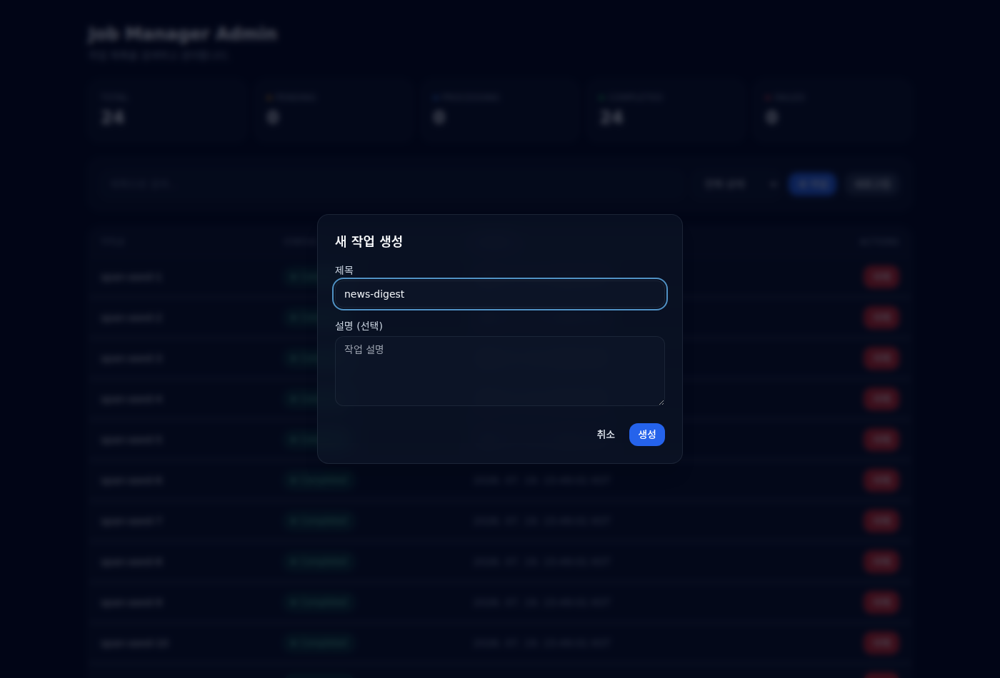
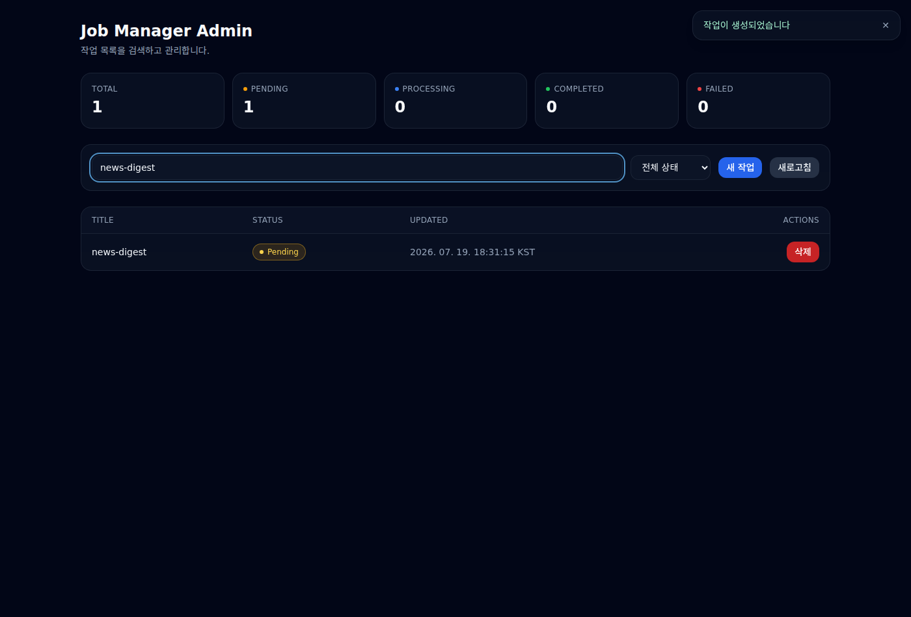
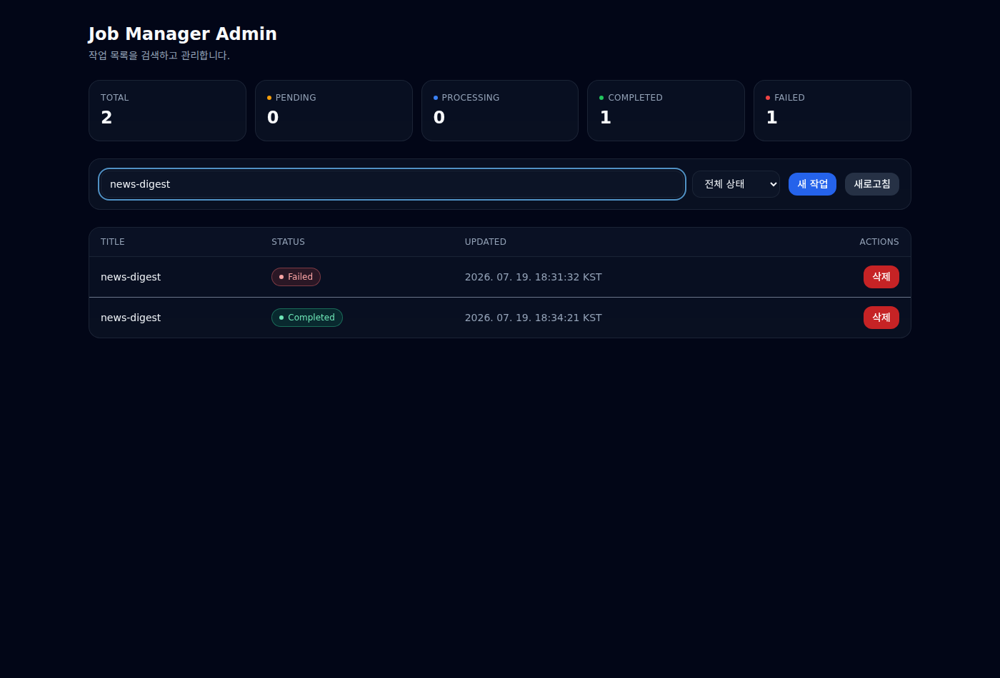

# us-all-job-manager

NestJS 기반 작업(Job) 관리 백엔드입니다(어스얼라이언스 백엔드 엔지니어 채용 과제,
[REQUIREMENTS.md](./REQUIREMENTS.md) 구현체). RESTful API로 작업을 생성·조회·검색하고, 백그라운드
스케줄러가 주기적으로 `pending` 작업을 처리합니다. 데이터는 단일 JSON 파일(`jobs.json`,
[node-json-db](https://www.npmjs.com/package/node-json-db))에 영속화하며, API와 스케줄러가 같은 파일에
동시에 접근해도 손실·깨짐이 없도록 인프로세스 직렬화 큐로 동시성을 제어합니다.

- **내부 구조·동작 상세**는 [ARCHITECTURE.md](./ARCHITECTURE.md)에 정리했습니다(API·스케줄러 구현과 동작,
  함수 흐름도, 뉴스 전달 프로그램).
- 설계 결정의 정본은 [`logs/20260717/implementation-design/09-final-design.md`](./logs/20260717/implementation-design/09-final-design.md)입니다.

> ⚠️ 이 저장소는 **public** 입니다. 커밋 전 반드시 시크릿(키·토큰·내부 경로·개인정보)을 스크러빙하세요.
> 시크릿은 커밋하지 말고 `.env`(gitignore됨)로 분리하시기 바랍니다.

## 목차
1. [설치](#1-설치)
2. [실행·검증 방법](#2-실행검증-방법)
3. [테스트](#3-테스트)
4. [API 사용법](#4-api-사용법)
5. [스케줄러 동작 시나리오](#5-스케줄러-동작-시나리오)
6. [개발 규칙(거버넌스)](#6-개발-규칙거버넌스)
7. [구현에 대한 본인 코멘트](#7-구현에-대한-본인-코멘트)

---

## 1. 설치

실증 환경은 **Node.js v24**(`package.json`의 `engines.node`는 `>=24`)입니다. Yarn(Berry)이 1급
패키지 매니저이며, 기본 Node 환경(`npm`)에서도 그대로 동작합니다.

```bash
# Yarn (권장)
yarn install
# npm (REQUIREMENTS "기본 Node 환경에서 npm install 후 실행" 요건)
npm install
```

### 환경변수(.env) — 뉴스 다이제스트 기능

비밀(API key·webhook URL)과 기능 플래그는 `.env`로 주입합니다. 저장소에는 `.env.example`만 커밋되고
`.env`는 추적에서 제외됩니다.

```bash
cp .env.example .env    # 이후 필요한 값을 채웁니다
```

기본값(`NEWS_DIGEST_ENABLED=false`)에서는 뉴스 기능이 꺼진 채 서버가 정상 기동합니다(비밀 불필요).

---

## 2. 실행·검증 방법

### 2.1 단독 실행

```bash
yarn start:dev                    # 개발(watch)
yarn build && yarn start:prod     # 프로덕션(dist/main.js)
```

기본 포트는 `3000`입니다(`PORT` 환경변수로 변경 가능). Tempo가 떠 있지 않은 단독 실행에서는 OTLP export가
실패해 콘솔에 연결 경고가 출력될 수 있는데, 이는 **정상이며 애플리케이션 동작에는 영향이 없습니다**.

### 2.2 관측성 스택(docker-compose) 기동

Grafana + Loki + Tempo + Alloy 전체 스택은 리포지토리 루트에서 아래 한 줄로 띄웁니다.

```bash
docker compose -f observability/docker-compose.yml up -d --build   # 기동
docker compose -f observability/docker-compose.yml ps              # 상태 확인
docker compose -f observability/docker-compose.yml down            # 중지
```

| 구성요소 | 접속 주소 | 비고 |
| --- | --- | --- |
| 앱(API) | http://localhost:8080 | 컨테이너 3000 → 호스트 8080(Grafana와 포트 충돌 회피) |
| Grafana | http://localhost:3000 | 대시보드 자동 프로비저닝 |
| Tempo | OTLP/HTTP `:4318` | 앱이 트레이스를 직접 전송 |
| Loki / Alloy | 내부 | Alloy가 `logs.txt`를 tail → Loki push |

자세한 구축·확인 절차는 [`observability/README.md`](./observability/README.md)를 참고하시기 바랍니다.

### 2.3 관리자 페이지 확인

관리자 SPA는 앱의 `/admin/` 경로에서 정적 제공됩니다.

- 스택 기동 시: http://localhost:8080/admin/
- 단독 실행 시: http://localhost:3000/admin/

목록 조회·검색·생성·수정·삭제·재시도를 화면에서 각각 확인하실 수 있습니다. 소스는 `admin-ui/`에 있으며,
수정 후에는 `yarn build:admin`으로 재빌드합니다(산출물 `public/`가 커밋됩니다). 인증은 과제 범위 밖으로
두었습니다(수용된 리스크).

> **오류 표시 확인**: 관리자 화면에서 **구현되지 않은 작업 유형**(예: 임의 제목)으로 작업 생성을 시도하면,
> 서버가 400 `UNSUPPORTED_JOB_TYPE`로 거부하고 화면에 오류 메시지가 표시됩니다(4.1 참조).

### 2.4 Grafana 대시보드 확인

http://localhost:3000 에 접속하면 자동 프로비저닝된 대시보드(작업 처리 패널 + `news-digest` 대시보드,
uid `newsdigest`)를 열람하실 수 있습니다. 트래픽을 생성한 뒤 패널이 갱신되는지 확인합니다.

```bash
bash scripts/observability-traffic.sh    # 예시 트래픽 생성
```

### 2.5 Tempo 트레이스 확인

Grafana의 **Explore → Tempo**에서 최근 트레이스를 열면 `scheduler.process-job` 아래
`news.fetch`/`news.summarize`/`news.notify` 스팬을 확인하실 수 있습니다. `logs.txt`의 `traceId`와 Tempo의
트레이스 ID가 동일해 로그↔트레이스 상호 이동이 가능합니다.

### 2.6 Swagger(API 문서) 접근

서버 기동 후 아래 경로에서 API 문서를 확인하실 수 있습니다.

- **Swagger UI**: http://localhost:3000/api-docs (스택 기동 시 http://localhost:8080/api-docs)
- **OpenAPI JSON**: `/api-docs-json`

각 엔드포인트의 요청/응답 예시는 DTO와 컨트롤러 데코레이터에 선언되어 UI에 그대로 노출됩니다.

### 2.7 뉴스 다이제스트 실행 확인

`.env`에 `GEMINI_API_KEY`·`SLACK_WEBHOOK_URL`을 채우고 `NEWS_DIGEST_ENABLED=true`로 둔 뒤, 제목이
`news-digest`인 작업을 등록하면 다음 tick(≤60초)에 스케줄러가 뉴스를 수집·요약해 Slack으로 전송합니다.

```bash
curl -s -X POST http://localhost:3000/jobs \
  -H 'Content-Type: application/json' \
  -d '{"title":"news-digest","description":"오늘의 뉴스 다이제스트"}'
```

실키가 없을 때는 `scripts/slack-mock-catcher.mjs`로 전송 결과를 로컬에서 확인하실 수 있습니다.

> **게이팅 규칙**: 뉴스 기능은 `NEWS_DIGEST_ENABLED === 'true'`(대소문자·공백 정규화) **그리고** 시크릿 2종이
> 모두 존재할 때만 활성화됩니다. 플래그만 켜고 시크릿이 없으면 안전한 no-op(비활성)으로 폴백하므로 잘못된
> 설정이 런타임 오류를 내지 않습니다.

---

## 3. 테스트

```bash
yarn test          # 유닛 테스트(도메인 guard·유스케이스·adapter·동시성 재현 C-1~C-5)
yarn test:cov      # 커버리지 게이트 포함
yarn test:e2e      # supertest 기반 API e2e
```

- 모든 테스트는 `os.tmpdir()` 하위 격리 디렉터리를 사용하므로, 리포지토리 루트의 `jobs.json`/`logs.txt`는
  건드리지 않습니다.
- 커버리지 임계값(`package.json`): 전역 statements 97% / branches 86% / functions 92% / lines 98%,
  `src/domain/`은 100%입니다. 실측치는 100%에 근접합니다(2026-07-19 기준 전역 98.7 / 94.3 / 95.1 / 99.0).

### 3.1 관리자 페이지 UI 테스트 시나리오

아래는 실제 측정 시나리오입니다: 관리자 페이지에서 작업을 **등록 → 확인 → 처리 결과 확인**까지 따라가며,
각 단계를 스크린샷으로 남겼습니다.

**① 등록** — 관리자 페이지(`/admin/`)에서 "새 작업"을 눌러 제목 `news-digest`로 작업을 생성합니다.



**② 확인** — 생성 직후 목록에 `Pending` 상태로 나타나고 "작업이 생성되었습니다" 토스트가 표시됩니다.



**③ 처리 결과 확인** — 다음 tick(≤60초)에 스케줄러가 처리하면 상태가 전이됩니다(성공 시 `Completed`).



> 관리자 페이지의 목록/검색/생성/수정/삭제/재시도 전 기능에 대한 UI E2E 스크린샷은
> [`logs/20260718/admin-page/`](logs/20260718/admin-page/)에 있습니다
> (예: [작업 생성 모달](logs/20260718/admin-page/E2E-12-create-modal.png),
> [오류 상태 표시](logs/20260718/admin-page/E2E-11-error-state.png)).

### 3.2 관측성 측정 결과(Grafana·Tempo·Loki)

위 시나리오의 처리 결과를 관측성 스택에서 측정한 스크린샷입니다(상세 절차는
[`logs/20260719/news-digest-verification/README.md`](logs/20260719/news-digest-verification/README.md) 및
[`logs/20260719/observability-verification/README.md`](logs/20260719/observability-verification/README.md) 참조).

- **Grafana 대시보드**:
  [SLO 대시보드 전체](logs/20260719/observability-verification/02-slo-dashboard-full.png) ·
  [처리 지연 p50 패널](logs/20260719/observability-verification/03-slo-p50-panel.png) ·
  [평균 Latency 대시보드](logs/20260719/observability-verification/06-avg-latency-dashboard.png)
- **Tempo 트레이스**:
  [scheduler.tick→process-job→news.\* 스팬 계층](logs/20260719/news-digest-verification/05-tempo-trace-news-spans.png) ·
  [스케줄러 tick 트레이스](logs/20260719/observability-verification/08-tempo-scheduler-tick.png) ·
  [GET /jobs 트레이스](logs/20260719/observability-verification/07-tempo-http-get-jobs.png)
- **Loki 로그**:
  [news-digest 이벤트](logs/20260719/news-digest-verification/04-loki-digest-event.png) ·
  [HTTP 요청 로그](logs/20260719/observability-verification/10-loki-http-logs.png) ·
  [에러 로그](logs/20260719/observability-verification/11-loki-error-logs.png) ·
  [로그→트레이스 파생 필드(상호 이동)](logs/20260719/observability-verification/09-loki-to-tempo-derived-field.png)

---

## 4. API 사용법

성공 응답은 리소스(또는 `{ items, count }`)를 반환하고, 실패 응답은 공통 envelope `{ code, message, details? }`를
반환합니다. Job 응답 형태는 `{ id, title, description, status, createdAt, updatedAt }`이며, `retryCount`는
내부 필드라 응답에 포함하지 않습니다.

엔드포인트는 6종입니다: `POST /jobs`, `GET /jobs`, `GET /jobs/search`, `GET /jobs/:id`, `PATCH /jobs/:id`,
`DELETE /jobs/:id`(REQUIREMENTS 5종 + 추가 `DELETE` 1종).

### 4.1 `POST /jobs` — 작업 생성

`POST /jobs`는 **실제 처리 로직이 구현된 작업 유형만** 생성합니다. 운영 배선에서 구현된 유형은 뉴스 다이제스트
sentinel 제목(기본 `news-digest`)이며, 그 외 제목은 400 `UNSUPPORTED_JOB_TYPE`로 거부됩니다(무동작으로
성공 처리되는 job이 생기지 않도록 한 의도적 결정 — 7절 참조).

```bash
curl -s -X POST http://localhost:3000/jobs \
  -H 'Content-Type: application/json' \
  -d '{"title":"news-digest","description":"오늘의 뉴스"}'
```

성공(201, `status`는 서버가 항상 `pending`으로 고정):

```json
{ "id": "b3f1...", "title": "news-digest", "description": "오늘의 뉴스", "status": "pending",
  "createdAt": "2026-07-19T09:00:00.000Z", "updatedAt": "2026-07-19T09:00:00.000Z" }
```

실패(400, 구현되지 않은 작업 유형):

```json
{ "code": "UNSUPPORTED_JOB_TYPE", "message": "구현되지 않은 작업 유형입니다: \"임의 작업\".",
  "details": [{ "field": "title", "reason": "현재 구현된 작업 유형: news-digest" }] }
```

실패(400, `title` 누락 — 형식 검증):

```json
{ "code": "VALIDATION_FAILED", "message": "요청이 유효하지 않습니다.",
  "details": [{ "reason": "title should not be empty" }] }
```

### 4.2 `GET /jobs` — 전체 목록 / `GET /jobs/search` — 검색

```bash
curl -s http://localhost:3000/jobs
curl -s 'http://localhost:3000/jobs/search?title=샘플&status=pending'
```

검색은 `title`(부분 일치, 대소문자 무시)과 `status`(완전 일치) 중 **최소 1개는 필수**이며, 둘 다 오면 AND
조건입니다. 목록/검색 응답은 `{ items, count }` 형태입니다.

### 4.3 `GET /jobs/:id` — 단일 조회

```bash
curl -s http://localhost:3000/jobs/<id>
```

미존재 시 404 `NOT_FOUND`를 반환합니다(`:id` 형식은 검사하지 않고, 비-UUID 값도 "찾을 수 없음"으로 취급).

### 4.4 `PATCH /jobs/:id` — 수정·재시도

바디는 `title?`/`description?`/`status?`(최소 1개 필요)이며, `status`는 `'pending'`만 허용합니다
(`failed → pending` 재시도 전용).

```bash
curl -s -X PATCH http://localhost:3000/jobs/<id> \
  -H 'Content-Type: application/json' -d '{"status":"pending"}'
```

- 허용되지 않는 전이: 409 `INVALID_TRANSITION`
- 재시도 상한(3회) 초과: 409 `RETRY_LIMIT_EXCEEDED`

### 4.5 `DELETE /jobs/:id` — 삭제

성공 시 204를 반환합니다. `processing` 상태의 작업은 409 `JOB_IN_PROGRESS`로 삭제가 금지됩니다.

### 상태 전이 규칙

| from \ to | pending | processing | completed | failed |
|---|---|---|---|---|
| pending | — | 스케줄러 전용 | — | — |
| processing | — | — | 스케줄러 전용 | 스케줄러 전용 |
| failed | **PATCH 전용, `retryCount < 3`** | — | — | — |
| completed | — | — | — | — (종단) |

### 상태 코드

| 코드 | 상황 |
|---|---|
| 200 | GET·PATCH 성공 |
| 201 | POST 성공 |
| 204 | DELETE 성공 |
| 400 | 형식 검증 실패(`VALIDATION_FAILED`) / 미구현 작업 유형(`UNSUPPORTED_JOB_TYPE`) |
| 404 | 대상 미존재(`NOT_FOUND`) |
| 409 | 무효 전이·재시도 상한·삭제 금지(`INVALID_TRANSITION`/`RETRY_LIMIT_EXCEEDED`/`JOB_IN_PROGRESS`) |
| 500 | 예기치 못한 오류(`INTERNAL`, 상세 미노출) |

---

## 5. 스케줄러 동작 시나리오

백그라운드 스케줄러가 작업을 어떻게 등록받아 처리하는지, 하나의 시나리오로 따라가 보겠습니다.

1. **등록**: 사용자가 `POST /jobs`로 `news-digest` 작업을 생성합니다. 서버는 구현된 작업 유형인지 검증한 뒤
   상태를 `pending`으로 고정해 `jobs.json`에 저장합니다(직렬화 큐 경유).
2. **tick 발화**: `@nestjs/schedule`의 `@Interval(60초)`가 `JobSchedulerAdapter.tick()`을 호출합니다. 이전
   tick이 아직 실행 중이면(`isTickRunning`) 새 tick은 즉시 스킵됩니다(중복 처리 방지).
3. **선점**: `ProcessPendingJobsUseCase`가 `pending` 작업을 최대 10건 조회하고, `withBatch`로 한 번에
   `processing`으로 선점합니다(파일 rewrite 1회).
4. **처리(락 밖)**: 각 작업을 `JOB_PROCESSOR`로 처리합니다. 처리기는
   `Tracing(Dispatching(News | Default))` 체인이라, `news-digest` 작업은 뉴스 파이프라인(수집→요약→Slack
   전송)으로, 그 외는 기본 처리기로 분기됩니다. 외부 I/O는 저장소 임계구역 **바깥**에서 실행되어 큐를 막지
   않습니다.
5. **커밋**: 성공은 `completed`, 실패는 `failed`로 `withBatch` 일괄 커밋하고, 작업별 전이 이벤트와 배치 집계를
   `logs.txt`에 남깁니다.
6. **재시도**: 스케줄러는 자동 재시도를 하지 않습니다. `failed` 작업은 사용자가 `PATCH`(`status: pending`,
   `retryCount < 3`)로 직접 재시도해야 합니다.

이 과정의 함수 흐름도와 동시성 보장(직렬화 큐 + guard-in-lock), C-1~C-5 재현 서사는
[ARCHITECTURE.md §2](./ARCHITECTURE.md#2-스케줄러-구현과-동작)에 정리했습니다.

---

## 6. 개발 규칙(거버넌스)

이 저장소는 GJC 10개 운영 규칙으로 관리됩니다. 요약은 [AGENTS.md](./AGENTS.md), 정규 문서는
[`.gjc/rules/`](./.gjc/rules)에 있습니다.

| # | 요약 |
|---|---|
| 1 | 모든 작업은 전용 git worktree에서 진행(메인 체크아웃 커밋 금지) |
| 2 | 설계 중요 기능은 ralplan 합의 후 구현 |
| 3 | Hexagonal/Clean Architecture, 도메인·유스케이스에 `@nestjs/*` 금지 |
| 4 | 설계 트레이드오프를 `logs/<KST-date>/<session-name>/`에 기록 |
| 5 | 파일 변경 전 사용자 공지·확인, 최종 게이트는 커밋/푸시 경계 |
| 6 | 완료 시 PR + 설계/보안/성능 3인 리뷰 |
| 7 | squash 머지, 한글 PR 제목·커밋, SemVer, CI 통과, `HISTORY/` export |
| 8 | 규칙을 `AGENTS.md`↔`CLAUDE.md` 동기화 |
| 9 | 사용자 제안·소통은 한국어 |
| 10 | export/public 함수·domain guard 한글 TSDoc, Job 처리기 디렉토리 흐름도 README |

---

## 7. 구현에 대한 본인 코멘트

REQUIREMENTS가 자유 설계로 열어둔 항목의 해석과 근거를 요약합니다. 상세는
[ARCHITECTURE.md](./ARCHITECTURE.md)와 설계 로그(정본:
[`09-final-design.md`](./logs/20260717/implementation-design/09-final-design.md))에 있습니다.

- **상태 전이·재시도**: `pending → processing → completed|failed`는 스케줄러 전용, `failed → pending`
  재시도만 API 전용으로 설계했습니다. 무한 재시도를 막기 위해 `retryCount < 3` 상한을 두었습니다.
- **에러 응답 코드**: `ValidationPipe` 기본값(400)을 그대로 사용하고(422 미채택), 리소스 부재는 404, 규칙상
  불허 전이·재시도 상한·삭제 금지는 409로 구분했습니다. 매핑 정본은 `resolveErrorEnvelope` 한 곳입니다.
- **동시성**: node-json-db 자체 락은 compound read-modify-write를 보호하지 못하므로, 인프로세스 **단일
  Promise 체인 직렬화 큐**로 감싸고 guard 평가를 큐 임계구역 안에서 최신 상태로 수행했습니다(guard-in-lock).
  "무보호 baseline을 실제로 재현한 뒤 보호 경로와 대조"하는 방식(C-1~C-5)으로 검증했습니다.
- **구현된 작업 유형만 허용(의도적 해석)**: REQUIREMENTS는 제네릭 job 모델을 열어두었지만, 실제 처리 로직이
  없는 작업이 "무동작으로 성공"하는 것은 API 계약상 정직하지 않다고 판단해, `POST /jobs`가 **구현된 작업 유형만
  수락**하고 그 외는 400 `UNSUPPORTED_JOB_TYPE`로 거부하도록 했습니다. 구현 유형 목록은 주입형 레지스트리라
  향후 처리기 추가 시 배선만 확장하면 됩니다. 이 결정으로 운영 배선에서는 `news-digest` 외 임의 제목 작업을
  새로 생성할 수 없습니다(기존 시드 샘플은 조회는 가능). 근거·blast radius는
  [`logs/20260719/ponytail-audit-docs/decision.md`](./logs/20260719/ponytail-audit-docs/decision.md)에 기록했습니다.
- **`DELETE /jobs/:id`(추가 구현)**: 명세의 5종 외에 삭제 1종을 추가했습니다(`processing`은 삭제 금지).
- **시간이 더 있다면**: `GET /jobs` 페이지네이션, `retryCount` 백오프, 외부 처리 작업용 큐/워커 확장,
  exactly-once 전송(outbox 패턴) 등을 후보로 남깁니다.
